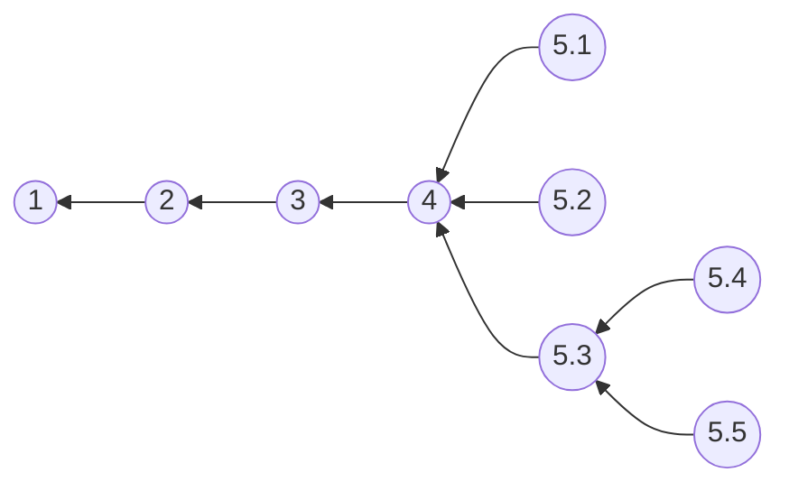

# OOP(E25) Workshop
**Topic:** Media Library

## Part 0: Introduction
### Introduction
 In this workshop, you will work in groups on a problem. We will start with a description of what needs to be developed and then go through all the development phases (and most of the curriculum).  

 The development will take place in sprints, i.e., you will work on one short sub-task at  a time. When you have finished one sprint, you can start the next one.

You choose your own group, and you choose where you to want to sit and work **(We will explain it in the next slide)**. but it is advisable not to stray too far from the lecturer or instructor (especially if you want credits on your pointgiving activity).


### When
Work on the workshop is scheduled for:
  
- Wednesday, November 19 at 8:15-12:00 in 247 and 136.
- Friday, November 21 at 10:30-14:30 in U109.

However, you are welcome to work on it outside of these periods if that suits you better.

### Sprints


## Part 1: Development
### Sprint 1: Project Creation
#### Exercise
In this sprint, you must create a repository on GitHub.
Specifically in this sprint:
1. One group member creates a Git repository on GitHub. It could be called `oop-workshop`.
2. The same group member adds the remaining group members to this repository.
3. Another group member creates a C# project and adds, commits, and pushes the relevant project files to this repository.
4. The remaining group member pull these changes and verify that they can compile the code.
5. If your repository doesn’t already has a `README.md` add one at the root of the project briefly mentioning **team members** and whatever else you deem **relevant to the project**.

---

### Sprint 2: From Program Specification to Class Diagram

#### Program Specification
Sønderborg’s library aims to launch a digital platform to manage and share its diverse digital media collection. The system should support multiple types of media, including: 
- **E‑books**, with information about their Title, Author, Language, Number of pages, Publication Year and ISBN where users can view, download and read them.
- **Movies**, with information about their Title, Director, Genre, Release Year, Language and Duration where users can watch and download them.
- **Songs**, with information about their Title, Composer, Singer, Genre, File type, Duration and Language where users can play and download them.
- **Video‑games**,  with information about their Title, Genre, Publisher, Release Year and Supported Platform where users can download, play and eventually complete them.
- **Apps**,  with information about their Title, Version, Publisher, Supported Platforms and File Size where users can download and execute them
- **Podcasts**,  with information about their Title, Release Year, Host(s), Guest(s),  Episode Number and Language where users can download and listen to an episode and complete it.
- **Images**,  with information about their  Title, Resolution, File format, File size and Date taken where users can download and display an image

All media items should be borrowable, and only users who have borrowed an item may rate it. 
Additionally extra information could be introduced if are crucial in your system's design.

The system must also support three categories of users: Admin, Employee and Borrower, where personal information such as Name, Age and CPR number is stored. As a starting point user authentication is not required . However on startup, the program should ask the user to identify their role. 
- **Borrower** interact with the collection by listing items by type, selecting and previewing details, rating items, and performing actions specific to the media type. 
- **Employee** is responsible for managing the collection with the ability to add or remove media items
- **Admin** has *Employee's* rights and additionally manage "Borrowers" and "Employees"(view, create, delete, update their personal information).  
Both user categories should have a clear and structured menu of the above mentioned actions.
      
The console interface should guide the user with clear instructions and validate all inputs. Errors or invalid actions should be handled beforehand. The design should anticipate growth in extensibility, ensuring that new media types or user roles can be added without disrupting existing functionality.

#### Exercise
In this sprint, you must analyze the program specification.  
Specifically, in this sprint you must:
1. Start by defining the requirements (Functional as well as non-Functional).
1. Perform a verb-noun analysis of the program specification.
1. Create the CRC cards to math the requirements and verb-noun analysis.
1. Based on this analysis, produce a UML class diagram.
1. Make sure to update your README with the results of the above analysis. For the diagrams you can use [Draw.io](https://www.drawio.com/) or [Mermaid](https://mermaid.js.org/syntax/classDiagram.html), which is supported in both GitHub's markdown files and GitHub's wiki.
Always push clean, error free code, preferably to a branch other than main.

**Hints:**
 1. Identify verbs (use, rate, download, play) and map them to interfaces (IRatable, IPlayable, IDownloadable).
 2. Favor composition and interfaces for capabilities instead of deep inheritance chains.
 3. Use polymorphism so you can expand the system with new media types or capabilities without changing existing code.
 4. Prefer an abstract base class when implementations shared state or common logic.
 5. Use 3-Layer Architecture like the example:
    - **Presentation**: Console UI, menus, input validation
    - **Domain**: models, capability interfaces, Library
    - **DataAccess**: file handlers (CSV loader)

### Proposed Repository Structure
```
oop-workshop/
├── README.md
├── docs/
│   └── ProjectSpecification.md
├── var/
│   └── data.csv
│
├── src/    ← (project)
│   ├── Program.cs
│   ├── Presentation/
│   │   └── ... terminal interaction code ...
│   ├── Domain/
│   │   ├── Media/
│   │   │   ├── Media.cs
│   │   │   └── ... media types ...
│   │   ├── Users/
│   │   │   ├── User.cs
│   │   │   └── ... user types ...
│   │   ├── Interfaces/
│   │   │   └── ... interfaces ...
│   │   └── Library.cs
│   │
│   └── Persistence /
│           └── ... persistence types ...
│   
└── tests/  ← (project)
    └── ... test files ...
```

---

### Sprint 3: From Class Diagram to Code
#### Task
In this sprint, you will convert your class diagram into code. The focus is not on creating a running program that solves a specific problem, but on having all the classes and functionality needed to set up a specific domain model.
Specifically in this sprint:
1. Implement your class diagram in C# and make sure that the code compiles without warnings.
    - Start by implementing classes and relationships between them.
    - Introduce exception and error handling 
    - Start with basic console UI and input validation.
1. Remember to commit and push the result to GitHub.
Always push clean, error free code, preferably to a branch other than main.

---

### Sprint 4: Test
#### Exercise
In this sprint, you will test your code.  
Specifically, in this sprint you will:
1. Write unit tests for each of your classes. As this is a major undertaking, you may choose to focus on a specific class.
    - Which functionalities should be tested?
    - What equivalence partitions and boundary cases do you have?
    - Which test cases are needed to test correctness?
    - Is your code correct?
1. Complementary you can manually test your code (e.g., printing to console)
2. Remember to commit and push the result to GitHub.
Always push clean, error free code, preferably to a branch other than main.

---

### Sprint 5: Extra Sprint

#### Extension 1: Implement additional capabilities 
The goal of this extension is to enrich interaction possibilities and demonstrate how the system can grow without altering its core structure.  
 To do this:
 - Expand the system by introducing new functional abilities for both media items and users.
 - Media types may gain additional behaviors and users may gain new actions

*Consider catching exception and error handling.*  
*Remember to commit and push the result to GitHub.*
*Always push clean, error free code, preferably to a branch other than main.*

#### Extension 2: Allow Borrower to sort a media list
 For this extensions, you should allow the Borrower to organize media lists using chosen criteria (such as title, genre, rating, or duration) Sorting should be intuitive, with alphabetical or numerical ordering. You can choose to implement one or more criteria.

*Consider catching exception and error handling.*  
*Remember to commit and push the result to GitHub.*
*Always push clean, error free code, preferably to a branch other than main.*

#### Extension 3: Persisted data using  external files
For this extensions, you will introduces saving and loading of media and user data  through external files The file type (csv, json, txt) is your choice. The system should  be able to reconstruct the state from these files and get with every change will update  the files.

*Consider catching exception and error handling.*  
*Remember to commit and push the result to GitHub.*
*Always push clean, error free code, preferably to a branch other than main.*

#### Extension 4: Borrow/return functionality
 For this extensions, you should allow borrowers to borrow media and later return them. In that case the media should be tagged as ”borrowed” and no other user can access the item The Borrower should get a message of the desired return date.  

 **Note:** You must complete extension 3 before starting this sprint.

*Consider catching exception and error handling.*  
*Remember to commit and push the result to GitHub.*
*Always push clean, error free code, preferably to a branch other than main.*

#### Extension 5: Add authentication
This extensions, introduces basic authentication, requiring users to log in with stored credentials. Authentication ensures that only registered administrators and borrowers can perform their respective actions, protecting the system from malicious actions.

 **Note:** You must complete extension 3 before starting this sprint.

*Consider catching exception and error handling.*  
*Remember to commit and push the result to GitHub.*
*Always push clean, error free code, preferably to a branch other than main.*
